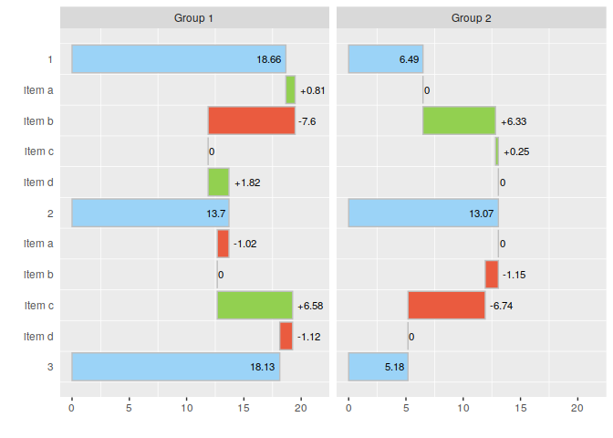

<!-- README.md is generated from README.Rmd. Please edit that file -->

# ggwaterfall

<!-- badges: start -->

<!-- badges: end -->

ggwaterfall provides tools to make waterfall charts based on ggplot2

## Example

Generate some random data.

``` r
library(ggwaterfall)
library(data.table)
library(magrittr)
library(ggplot2)

# simulate data
set.seed(1L)

nitems <- 5
ntime <- 2

DT <-
  data.table(
    group = rep(c("Group 1", "Group 2"), each = nitems),
    item  = paste0("item ", rep(letters[1:nitems], each = ntime)),
    time  = rep(1:ntime, times = nitems),
    value = 6 + rnorm(nitems * ntime)
  )

DT
#>       group   item time    value
#>  1: Group 1 item a    1 5.373546
#>  2: Group 1 item a    2 6.183643
#>  3: Group 1 item b    1 5.164371
#>  4: Group 1 item b    2 7.595281
#>  5: Group 1 item c    1 6.329508
#>  6: Group 2 item c    2 5.179532
#>  7: Group 2 item d    1 6.487429
#>  8: Group 2 item d    2 6.738325
#>  9: Group 2 item e    1 6.575781
#> 10: Group 2 item e    2 5.694612
```

``` r

waterfall(
  data       = DT,
  detail_var = "item",
  base_var   = "time",
  value_var  = "value"
) %>%
  plot()
```


Plot a more advanced waterfall charts with multiple periods.

``` r
# simulate new data
set.seed(1L)

nitems <- 4
ntime <- 3

DT <-
  data.table(
    group = rep(c("Group 1", "Group 2"), each = nitems),
    item  = paste0("item ", rep(letters[1:nitems], each = ntime)),
    time  = rep(1:ntime, times = nitems),
    value = 6 + rnorm(nitems * ntime)
  )
#> Warning in as.data.table.list(x, keep.rownames = keep.rownames, check.names
#> = check.names, : Item 1 has 8 rows but longest item has 12; recycled with
#> remainder.

DT
#>       group   item time    value
#>  1: Group 1 item a    1 5.373546
#>  2: Group 1 item a    2 6.183643
#>  3: Group 1 item a    3 5.164371
#>  4: Group 1 item b    1 7.595281
#>  5: Group 2 item b    2 6.329508
#>  6: Group 2 item b    3 5.179532
#>  7: Group 2 item c    1 6.487429
#>  8: Group 2 item c    2 6.738325
#>  9: Group 1 item c    3 6.575781
#> 10: Group 1 item d    1 5.694612
#> 11: Group 1 item d    2 7.511781
#> 12: Group 1 item d    3 6.389843
```

Plot a simple waterfall chart.

``` r

waterfall(
  data       = DT,
  detail_var = "item",
  base_var   = "time",
  value_var  = "value"
) %>%
  plot()
```


You can make use of facetting with `by_var` arguments:

``` r

waterfall(
  data       = DT,
  detail_var = "item",
  base_var   = "time",
  by_var     = "group",
  value_var  = "value"
) %>%
  plot()
```


Or flip the chart with flip = TRUE:

``` r

waterfall(
  data       = DT,
  detail_var = "item",
  base_var   = "time",
  by_var     = "group",
  value_var  = "value"
) %>%
  plot(
    select = (time > 1 | is_aggr),
    flip = TRUE,
  )
```



Use can still adapt the chart with comomn ggplot2 API:

``` r

DTwf <- 
  waterfall(
    data       = DT,
    detail_var = "item",
    base_var   = "time",
    by_var     = "group",
    value_var  = "value"
  )

DTwf %>% 
  plot(
    flip = TRUE,
  ) + 
  ggtitle("Add this title here")
```


\`\`\`
